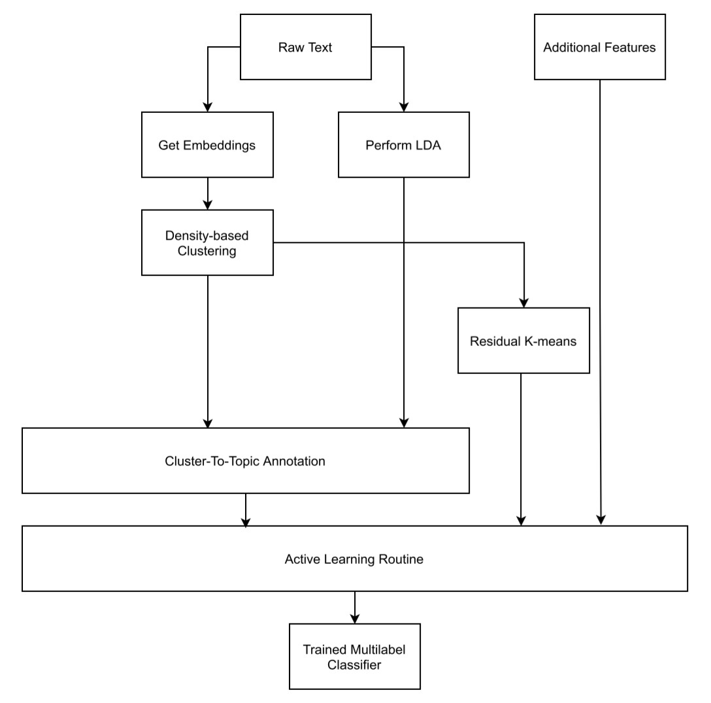

# Feature Generator Standard Pipeline

In the following, find a basic configuration for a pipeline that trains an activ learning classifier for user specified annotation of articles into topics. 

## Explanation of the Pipeline Procedure

Open file *feature_generator_Part1.py*. It calls the various functions needed, and stores the returned dataframes into csv files. In the following only the functions are described.  

The following variables can be set in *feature_generator_Part1.py*, which is the procedure for the main pipeline.

> article_df

*article_df* stores the path of the origin file for the pipeline.

> mallet_path

This stores the path to the installation of mallet LDA. Default case is *feature_generator/utils/mallet/bin*, change it if a mallet installation already exists on system. 

### Part 1:

The pipeline follows the following procedures by calling several functions. Only variable `article_df` needs to be changed. All other filepaths are predefined in default values such that the standard pipeline works. All files are stored in folder *files*. This includes *Mallet*, which is also included in the package under *utils/mallet*.

#### P1.preprocess(df: pandas.DataFrame)

> **takes:** The dataframe from variable `article_df`. Required are column names "Text", "TopicDD", "LanguageDD"
>
> **returns:** A preprocessed dataframe P1_df, text is cleared of `\n` characters.

#### I2.embeddings(path: Str, article_len: Int, clip: Int, components: Int, neighbors: Int)
> **takes:** A path to a csv file saved internally within the file system before with a text column. It was generated by the `preprocess` method earlier. In our case the file is called 'artikel.csv'
>
> **parameters:** *path*: can be left as is, *article_len*: max. length of one input text, *clip*: optional use to run pipeline taking only first N texts as input, *components*: #TODO, *neighbors*: #TODO
>
> **returns:** A dataframe with additional columns `dim` and `reduced_dim`, where *dim* are the embeddings of a Roberta Language model and *reduced_dim* is the reduced space, for processing on algorithms that don't take high-dimensional data.

#### I3.topicmodel_from_csv(nr_of_ranks = int, cluster_lb: Int, sample_lb: Int)
> **takes:** Default: A path to a csv saved internally within the file system with a text column.
>
> **parameters:** Input specifications for clustering algorithm `HDBSCAN`: int *nr_of_ranks* specifying how many top words per cluster are in the returned dataframes, *cluster_lb*: specifying minimal cluster size, *sample_lb*: specifying minimum number of samples #TODO
>
> **returns:** 2 dataframes with various unsupervised generated features from the *Text* column and numerical embeddings namely:
> 
> - First dataframe:  Same as table from the input path `articles_df` with additional column *clusterID* from HDBScan
> 
> - Second dataframe: A table with *nr_of_ranks* terms for each cluster generated by HDBScan, ranked by TF-IDF and TF. 

#### I5.generate_LDA(mallet_path: Str, start: Int, limit: Int, step: Int)
The following function trains multiple LDA models using mallet wrapper for python. Various model configurations are trained and the best one (based on coherence score) will be used. Parameters *start* and *limit* are passed to the function in order to predefine the range of topics to be trained. 

> **takes:** `mallet_path` as defined in section **PATHS** above, a path to a csv file saved within the file system with a *text* column, *start:* defines nr. of topics to start building an LDA model, *limit:* max. nr. of topics a model can have, *step:* difference in nr of topics between two successive builds.
> 
> **returns:**
> - *dataframe I5_df_dom:* assigns for each article the corresponding LDA features *LDA_Dominant_Topic*, *LDA_Topic_Perc_Contribution* and *Keywords*.
> - *dataframe IF_df_repres:* assigns for each topic features such as *Keywords* or most representative Text for a topic.  

#### C1_1.aggregate_dfs()

> **takes:** argument implicit: *I3_output_df_clustered.csv*, *I5_output_LDA_dominant_topic.csv*
> 
> **returns:** An aggregated dataframe with features generated from the LDA and features generated from HDBScan

#### Now use either: 
- **O1_1.annotate_topics_in_terminal()**

This function can be used instead of `O2.create_tables_for_annotation()`. It provides overview over each cluster that was generated unsupervised. It presents cluster features and requests a label for that cluster from the user via command line input. 
> **takes:** nothing, is accessing the files from folder *files*
> 
> **returns:** *dataframes O1_df_annotation_hdbscan*, *O1_df_annotation_lda*

- **O2.create_tables_for_annotation()**
> **takes:** implicit CSVs from LDA and Unsupervised HDBScan Clustering that were stored in *files* folder earlier.
>
> **returns:** 2 dataframes for the purpose of the annotation: *Part_1_hdbscan_results.csv* , *Part_1_lda_results.csv*

The column to be annotated is `User_Annotation` in both files. In this first manual annotation round all clusters resulting from the unsupervised methods need to be assigned to the user's own topic system, which is preferably coded in int numbers. This encoding is later required for the active learning classifier in section **C**. 

### Part 2:

Run python script `feature_generator_Part2`, which reads the annotated tables. 

#### O3.write_annotations()
> **takes:** the 2 dataframes that were user-annotated in 02
>
> **returns:** applied user annotated topics for each cluster to each text in a single dataframe `O3_df_articles.csv`

#### C.classify(label_column_name: Str, *args: List[Str])
> **takes:** a label column on which the classifier is trained, followed by several specified columns for classifier features
>
> **returns:** None
> **output:** csv table in *files/labeled_timestamp.csv*
