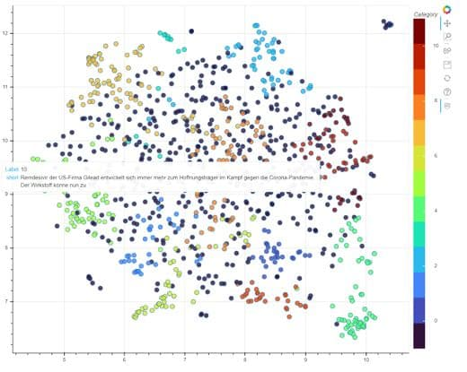
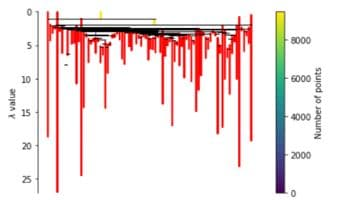
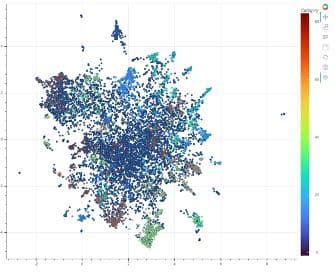
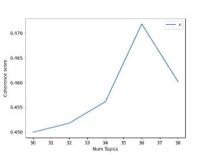

# Entwicklungsprotokoll

## Recherche

## Topic Model

### Iteration 1

- Artikel Embedding mit SentenceTransformer('T-Systems-onsite/cross-en-de-roberta-sentence-transformer') 
    - nur erste 1000 Artikel aus Effizienzgruenden
- Dimensionalitätsreduktion mit UMAP
    - n_components=10, n_neighbors=18
- Clustering mit HDBSCAN
    - Pro Artikel -> Topic 
    - min_cluster_size=15, prediction_data=True, min_samples=6) 
- Visualisierung durch scatterplot mit bokeh 


### Iteration 2
- Artikel Embedding mit SentenceTransformer('T-Systems-onsite/cross-en-de-roberta-sentence-transformer') 
    - **Artikelcharakteranzahl auf 800 limitiert**
    - **Alle Artikel einbezogen**
- Dimensionalitätsreduktion mit UMAP
    - n_components=10, n_neighbors=18
- Clustering mit HDBSCAN
    - Pro Artikel -> Topic 
    - min_cluster_size=15, prediction_data=True, min_samples=6) 
- Visualisierung durch scatterplot mit bokeh 

### Iteration 3
- In I3_topicmodel_from_csv.ipynb werden Embeddings nun direkt aus copy_artikel_embedded_800 verwendet 
- Output: I3_output_df.csv 
    - Enthält zusätzlich die Wahrscheinlichkeiten der Clusterzugehörigkeit für jeden Artikel
- Artikel Embedding mit SentenceTransformer(‘T-Systems-onsite/cross-en-de-roberta-sentence-transformer’) 
    - Text pro Artikel auf 800 Zeichen limitiert (Durchschnittsparagraphenläne: 200 Wörter, Durschnittliches Deutsches Wort  durchschnittlich 5 Zeichen, ausgenommen space), dafür Limitation aus Iteration 1 von 1000 Artikeln aufgehoben und alle Artikel einbezogen -> 9570 Kurzartikel
- Dimensionalitätsreduktion mit UMAP
    - n_components=10, n_neighbors=18
- Clustering mit HDBSCAN
    - Pro Artikel -> Topic 
    - min_cluster_size=15, prediction_data=True, min_samples=6)


- **Ranking (nach c TF IDF und TF) mithilfe von a für jedes einzele  Cluster erstellen**

### Iteration 4

### Iteration 5
LDA





## Retrieve

### R1
- Semantische Suche (Retrieval) 
    - Mit SentenceTransformer 'T-Systems-onsite/cross-en-de-roberta-sentence-transformer' 
    - Top 10 Resultate ausgeben

### R2
Task: Schrittweise Verfeinerung der residuals 

- Ausführung des Clusterings wie in I2, jedoch mit skimming approach nachdem qualitativ hochwertige Cluster abgeschöpft wurden, wird Clustering erneut mit neuen Parametern durchgeführt 
    - Qualitativ Akzeptabel: 3 Iterationen (nachher Clusteringfähigkeit ausgeschöpft) 

```
Labelled 4454 successfully in I0 

Segmented into: 83 Clusters. 

Labelled 2055 successfully in I1 

Segmented into: 38 Clusters. 

Labelled 2950 successfully in I2 

Segmented into: 3 Clusters. 
```

- Baseline algorithmus für Vorschläge (eingegebene Keywords) implementiert. 
    - Bewegung im Semantischen Raum, Epsilonhüllen Generierung und Ausgabe der Relevantesten Artikel 


### R3


## Overview

### O1_1
- Present each cluster (HDBSCAN and LDA) for annotation showing example texts, cTFIDF, TF 
- user annotates clusters with own labels one by one in terminal 
- Annotated clusters saved to 2 DFS 
    - O1_df_annotation_hdbscan.csv 
    - O1_df_annotations_lda.csv 

### O2
Use for annotating directly in csv table.
- Task: Prepare tables for annotation 
- Annotated clusters saved to O2_df_annotation_hdbscan.csv and O2_df_annotation_lda.csv

### O3


## Classify

### C1

    